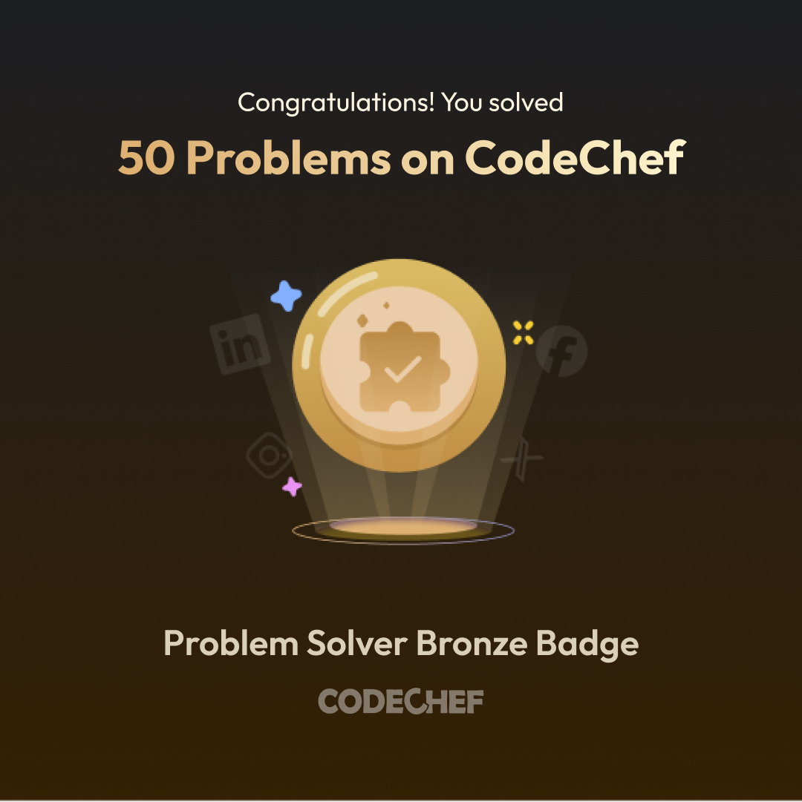

**#My CodeChef Java Journey**
I am learning Java with zero coding knowledge! Here is a tracker of my solved problems and current scores
**##My Progress Scoreboard**
| Team Performance Tracker | [https://www.codechef.com/learn/course/java-development/QMDQQC/problems/TONKSS05](https://codechef.com) | ✅ Solved | 100/100 |
**Another code another experience**
| Distance and Travel Status Tracker | [https://www.codechef.com/learn/course/java-development/QMDQQC/problems/TONKSS10?tab=Help](https://codechef.com) | Solved | Completed |
**#Improving myself**
 | Student Performance Tracker | [https://www.codechef.com/learn/course/java-development/QMDQQC/problems/TONKSS15](https://codechef.com) | Solved | 100/100 |
**##Working with final keyword to declare constants**
| Speed Limit Enforcement System | [https://www.codechef.com/learn/course/java-development/QMDQQC/problems/TONKSS30](https://codechef.com) | Solved | Finished |
**#Learning addition operator**
| Tracking daily exercise in java | [https://www.codechef.com/learn/course/java-development/NREETQ/problems/CRQDWE05](https://codechef.com) | Solved | Finished |
**##Learning subtraction operator**
| Track Poster Stock | [https://www.codechef.com/learn/course/java-development/NREETQ/problems/CRQDWE10](https://codechef) | Done | 100/100 |
**#Learning multiplication operator**
| Fundraising Event Management | [https://www.codechef.com/learn/course/java-development/NREETQ/problems/CRQDWE15](https://codechef) | Passed | 100/100 |
**##Learning division operator**
| Calculating the Average Candy | [https://www.codechef.com/learn/course/java-development/NREETQ/problems/CRQDWE20](https://codechef) | Solved | Completed |
**#My progress**
| Currency Exchange Rates and Conversions | [https://www.codechef.com/learn/course/java-development/NREETQ/problems/CRQDWE30](https://codechef) | Solved | 100/100  |
**#operarors topic practice**
| Check Vehicle Number Properties | [https://www.codechef.com/learn/course/java-development/NREETQ/problems/CRQDWE25](https://codechef) | Solved | Completed |

**#MY Assignment**
| Grocery Bill Calculator | [https://www.codechef.com/learn/course/java-development/TCXDPZ/problems/SKDNBU05](https://codechef) | Done | Completed |
# Practicing assignment operator
| Bank Calculator | [https://www.codechef.com/learn/course/java-development/TCXDPZ/problems/SKDNBU10](https://codechef) | Finished |
# Practicing second type assignment operator
| Fuel Consumption Tracker | [https://www.codechef.com/learn/course/java-development/TCXDPZ/problems/SKDNBU15](https://codechef) | Completed |
# Practicing third type assignment operator
| Salary Bonus Calculator | [Vhttps://www.codechef.com/learn/course/java-development/TCXDPZ/problems/SKDNBU20](https://codechef) | Finished |
# Practicinf forth type assignment operator
| Data Storage Converter | [https://www.codechef.com/learn/course/java-development/TCXDPZ/problems/SKDNBU25](https://codechef) | 100/100 |
## Practicing fifth type assignment operator
| Parcel Distribution System | [https://www.codechef.com/learn/course/java-development/TCXDPZ/problems/SKDNBU30](https://codechef) | Solved |
# Practicing chain assignment operator
| Inventory Stock Adjustment | [https://www.codechef.com/learn/course/java-development/TCXDPZ/problems/SKDNBU35?tab=Help](https://codechef) | 100/100 | 

